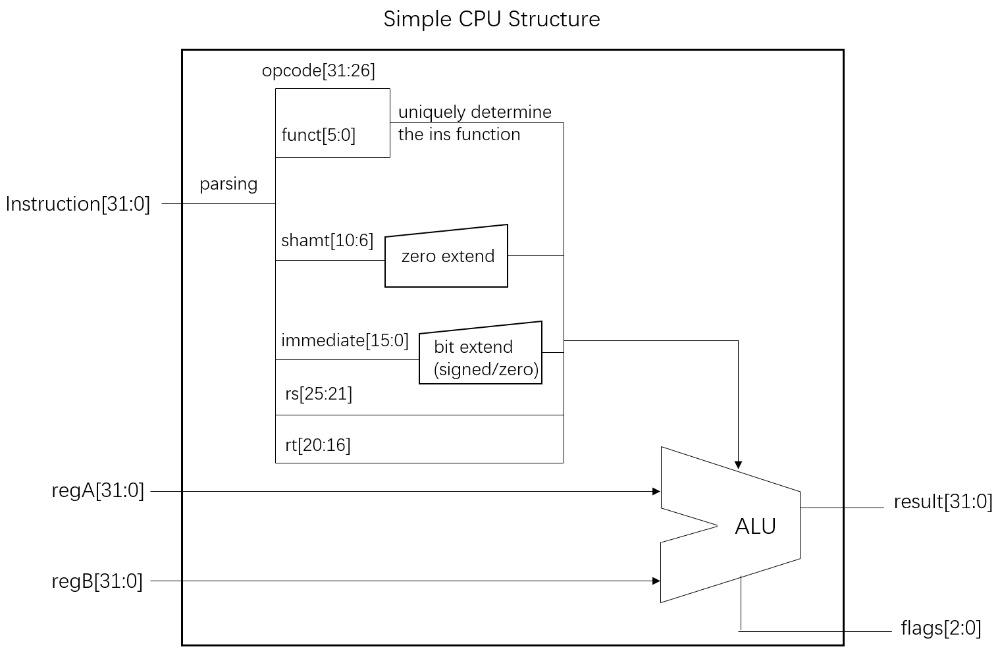

# CSC3050 Assignment3 Report
#### Name: Xiang Fei
#### Student ID: 120090414

## 1. Design
### 1a. Overview
This project is using Verilog, a hardware descriptive language, to implement an important computation unit in CPU, the Arithmetic and Logic Unit(ALU). And in fact, we need to implement a simple CPU which can parse the machine code of MIPS instruction. In my ALU.v file, I construct a module alu to implement the whole logic. And I also have a test_ALU.v file to test my module.
```verilog
module alu(instruction, regA, regB, result, flags);
```

### 1b. Structure
> The following figure shows the structure of my simple CPU.
 


Here, we have three inputs: instruction[31:0], regA[31:0], regB[31:0]. In fact, regA and regB are register values, which shows that we actually implement register value fetching. And for instruction, in my module, I do the parsing process to get opcode[31:26], funct[5:0], shamt[10:6], immediate[15:0], rs[25:21], rt[20:16]. Since we only have two registers, the value of rs and rt can only be 00000(registerA) and 00001(registerB). We have two outputs: result[31:0] and flags[2:0]. The first bit (MSB) of flags is zero flag, the second bit is negative flag, the third bit is overflow flag. For the zero flag, I only consider **beq** and **bne** instruction. For the negative flag, I only need to deal with **slt , slti , sltiu , sltu** instruction. For the overflow flag, I only consider **add, addi,** and **sub** instruction.

## 2. Implementation Details
### 2a. Determine the instruction function in ALU
To simplify the problem, I just use opcode and funct I get from parsing mips machine code to determine which function the instruction should use. For example, if opcode is 000000 and funct is 0x20, then the instruction should use the function for **add**. If opcode is 001000, then the instruction should use the function for **addi**. 

### 2b. Verilog reg I use in my module
In my alu module, I use the following registers to store data.
```verilog
reg[5:0] opcode, funct;
reg[4:0] shamt;
reg signed[31:0] signed_rs, signed_rt, ALU_result;
reg[31:0] unsigned_rs, unsigned_rt;
reg[31:0] immediate;
reg[2:0] flags;
reg[4:0] rs;
reg[4:0] rt;
reg check_bit; //it is used to check the overflow
```

#### (1) signed and unsigned operations
Here, I want to stress the meaning of signed_rs, signed_rt, unsigned_rs and unsigned_rt. The first two registers are used to store the signed values, and the last two registers are used to store the unsigned values. In this way, we can do both signed operation and unsigned operation. We should pay attention that in verilog, we can only implement signed operation if both operators are signed values, otherwise it is a unsigned operation. For example, if a signed value plus a unsigned value, it is still a unsigned operation.


#### (2) check the overflow case
I also want to stress the check_bit register, which is used to check whether it is a overflow case. I take add case as an example.

```verilog
{check_bit, ALU_result} = {signed_rs[31],signed_rs} + {signed_rt[31],signed_rt};
flags[2] = 1'b0;
flags[1] = 1'b0;
flags[0] = check_bit ^ ALU_result[31];
```

check_bit stores the sum of two signed bits. And the overflow flag in fact is check_bit XOR the most significant bit of the sum of two operators.


#### (3) Extension for immediate
Here, I use a 32 bits register **immediate** to store the value of immediate. But we know that immediate in mips code is only 16 bits, why I use 32 bits register? In fact, I do the extension manually. For **andi, ori, xori**, I use the zero extend like the following way.
```verilog
immediate = {{16{1'b0}},instruction[15:0]};
```
For other instructions, I use signed extend like the following way.
```verilog
immediate = {{16{instruction[15]}},instruction[15:0]};
```

### 2c. Some details of the instructions
* **beq** and **bne**
Here, we need to pay attention that the zero signal of these two instructions are the same. This is because the basic implementation of them are both subtract, and the results are the same when the inputs are the same.

* **sllv**, **srlv**, **srav**
For these three instructions, we just shift 5 bits of the value of rs, which is rs[4:0]. The code is in the following.
```verilog
ALU_result = signed_rt >> signed_rs[4:0];
```

## 3. test_ALU.V
For test_ALU.v file, I just need to stress that I use a task called test_bench to implement. And For every instruction, I invoke this task several times to do several tests. The task design code is like the following.

```verilog
task test_bench;
    input[31:0] instruction_t;
    input[31:0] regA_t, regB_t;
    input[31:0] result_t;
    input[2:0] flags_t;
    begin
        instruction = instruction_t;
        regA = regA_t;
        regB = regB_t;
        #10
        $write("instruction:%b; regA:%h regB:%h opcode:%h funct:%h; result:%h flags:%b;\tInfo: ",instruction_t,regA_t,regB_t,testalu.opcode,testalu.funct,result,flags);
        if(result === result_t && flags === flags_t)
            $display("PASS");
        else
            $display("WRONG");       
    end
endtask

```